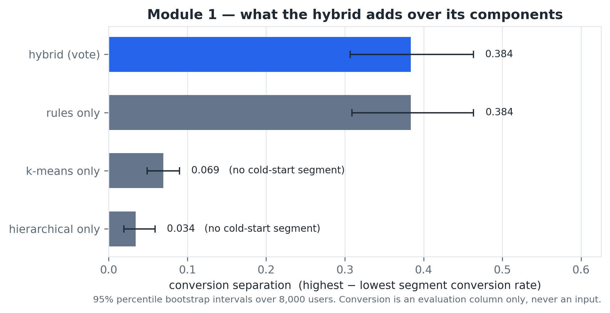
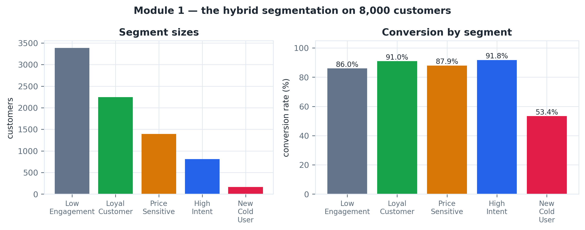
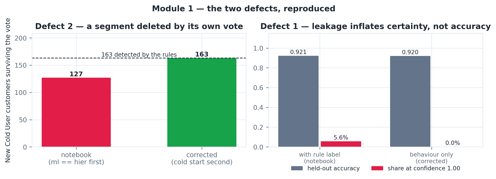
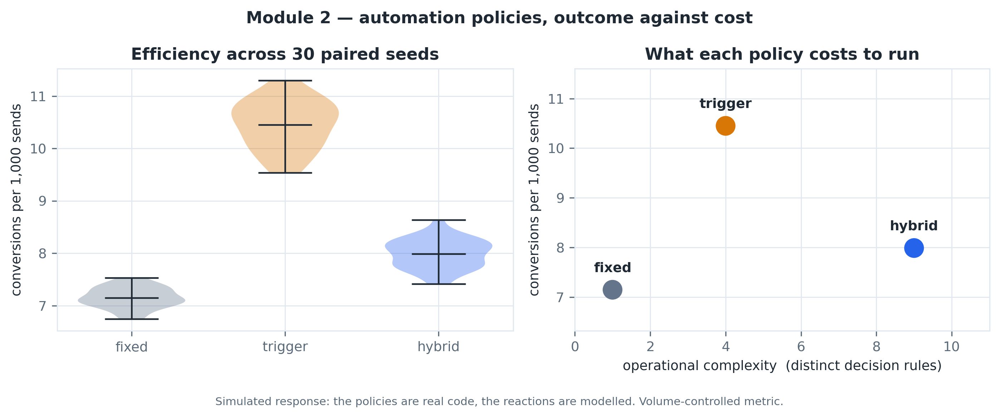
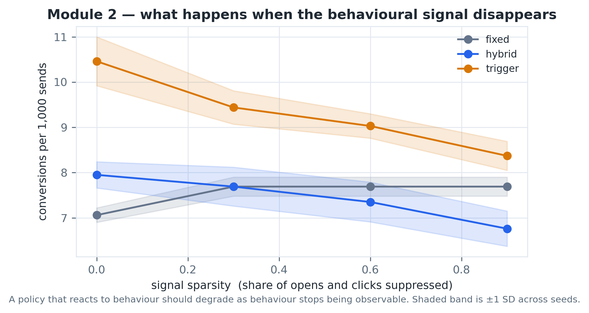
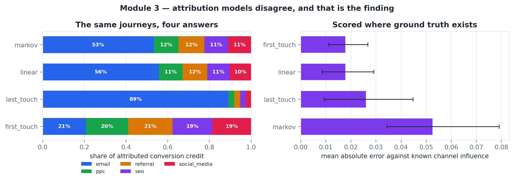
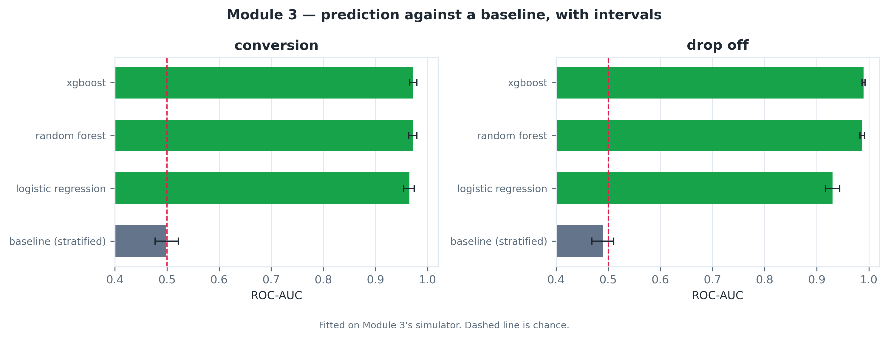
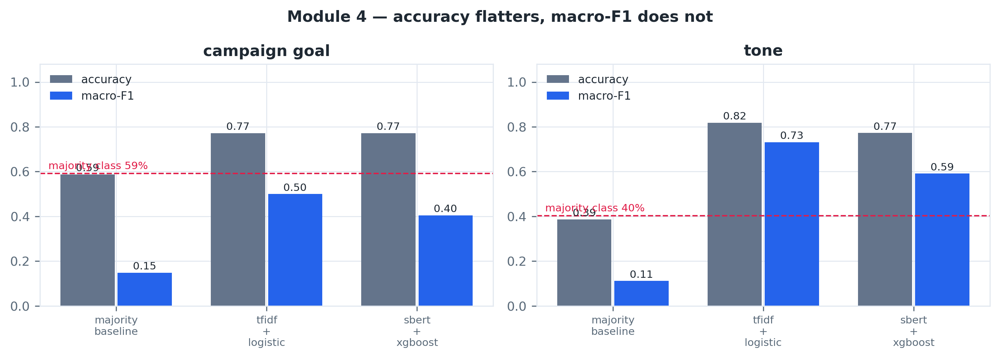
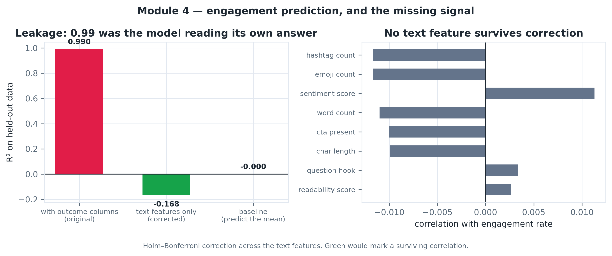
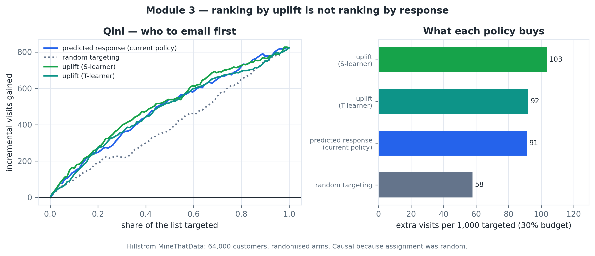

# RESULTS

## 3.1 Segmentation — the hybrid against its components

**Table R3 — Each method scored on the same 8,000 customers, with 95% bootstrap intervals.**

| Method | Segments | Separation | 95% CI | Cold-start segment |
|---|---|---|---|---|
| rules only | 5 | 0.3837 | [0.309, 0.464] | yes |
| k-means only | 4 | 0.0693 | [0.049, 0.090] | no |
| hierarchical only | 4 | 0.0343 | [0.019, 0.059] | no |
| hybrid (vote) | 5 | 0.3838 | [0.307, 0.463] | yes |

*Figure R1 — Conversion separation by method. The hybrid and the rules are indistinguishable; clustering alone separates almost nothing.*

The hybrid separates conversion by 0.3838, against 0.3837 for the rules alone. The difference is within noise. Clustering on its own reaches 0.0343.

> **This is a negative result, and it is reported as the headline rather than buried.** On the separation metric the clustering contributes nothing. The hybrid earns its place in the system on different grounds — it produces a calibrated confidence from the level of agreement between three independent methods, and the vote is what makes cold start explicit — but it does not separate conversion better than a handful of interpretable rules.

Silhouette is 0.0869. The clusters overlap heavily in feature space, and all three methods disagree for 35.3% of customers. The segments are commercially useful without being geometrically clean, and reporting only the separation would hide that.

*Figure R2 — Segment sizes and conversion rate per segment.*

## 3.2 Two defects, reproduced and measured

### 3.2.1 A segment deleted by its own vote

The original agreement vote tested whether the two clusterings agreed *before* it tested whether the rules had identified a cold-start customer. Clustering cannot represent “there is not enough evidence about this person” — it must place everyone somewhere — so whenever the two clusterings happened to agree, they overruled the rules. Of 163 cold-start customers the rules detect, that ordering keeps 127; on the live audience the segment went to zero. Novel Contribution 1 was being erased from its own output.

Resolving cold start immediately after unanimity keeps all 163. Those customers convert at 53.4% against 88.4% for everyone else, so the segment the original code discarded is the one with the most distinctive behaviour in the dataset.

> The general principle, and the one worth defending in a viva: **a method that cannot represent a finding does not get a vote on it.**

### 3.2.2 Target leakage in the confidence model

The Random Forest was trained with the rule label among its input features while the target was the hybrid consensus — so it was largely reading off its own answer. Reproducing both versions on the same split shows accuracy barely moves (0.9213 against 0.9200), but certainty changes by a factor of 150: 450 customers emerge at confidence 1.00 with the rule label among the inputs, against 3 without it.

Accuracy is not what the defect corrupts. The confidence attached to every downstream decision is — and a model whose accuracy is honest while its confidence is not will be trusted in exactly the cases where it should not be. That is also why the defect survived review: nothing fails, no test goes red, and the only symptom is a confidence column that looks impressive.

*Figure R3 — Both defects reproduced against their fixes.*

## 3.3 Automation policies — outcome against cost

**Table R4 — Policy comparison over 30 paired seeds on the Module 2 simulator.**

| Policy | Conv. per 1,000 sends | 95% range | Messages/user | Decision rules |
|---|---|---|---|---|
| fixed | 7.15 | [6.75, 7.49] | 4.0 | 1 |
| trigger | 10.45 | [9.62, 11.17] | 1.32 | 4 |
| hybrid | 7.99 | [7.45, 8.41] | 3.05 | 9 |

**Table R5 — Head-to-head, paired by seed.**

| Comparison | Mean difference | 95% CI | Wilcoxon p | Cliff's δ | Extra rules |
|---|---|---|---|---|---|
| hybrid − fixed | 0.837 | [0.727, 0.944] | 1.86e-09 | 0.991 | 8 |
| hybrid − trigger | -2.462 | [-2.574, -2.347] | 1.86e-09 | -1.0 | 5 |
| trigger − fixed | 3.299 | [3.146, 3.447] | 1.86e-09 | 1.0 | 3 |

*Figure R4 — Efficiency across seeds, and what each policy costs to run.*

**Table R6 — The same three policies measured on the imported audience in the running system.**

| Policy | Sent | Clicks | Conversions | Conv. per 1,000 sends | Rules |
|---|---|---|---|---|---|
| fixed | 500 | 144 | 36 | 72.0 | 1 |
| trigger | 400 | 111 | 44 | 110.0 | 4 |
| hybrid | 400 | 108 | 39 | 97.5 | 8 |

> **The simulation and the live build disagree about which policy wins.** Both metrics are volume-controlled, so the difference lies in how response is modelled — the simulator's segment-level propensities against per-customer rates drawn from each customer's own recorded email history. Neither is an observation of real people reacting. The ranking is evidently not robust to that choice, and that instability is the result. Quoting whichever run supports the preferred conclusion would be the one genuinely dishonest option available here.

*Figure R5 — Efficiency as the behavioural signal is suppressed. A policy that reacts to behaviour should degrade as behaviour stops being observable.*

## 3.4 Attribution — four models, four answers

**Table R7 — Attribution models scored against known channel influence on simulated journeys.**

| Model | MAE | 95% CI | Channels |
|---|---|---|---|
| first_touch | 0.0178 | [0.0112, 0.0268] | 5 |
| linear | 0.0178 | [0.0086, 0.0292] | 5 |
| last_touch | 0.026 | [0.0094, 0.0448] | 5 |
| markov | 0.0525 | [0.0345, 0.0791] | 5 |

On the live journeys of 7,811 converting customers the models disagree over 68% of all attributed credit at the widest pair, and 35% on average. Last-touch hands the great majority of credit to email; first-touch spreads it almost evenly across the acquisition channels.

> A company reading only its last-touch dashboard would conclude that email is responsible for nearly everything, and would cut the acquisition spend that built the audience email later converted. The disagreement between models is not a defect in one of them — it is the finding.

20% of converting journeys have a single touchpoint. On those, every model agrees by arithmetic, and that agreement must never be read as corroboration.

*Figure R6 — The same journeys under four attribution models, and their error where ground truth exists.*

## 3.5 Prediction, and what the move to another audience costs

**Table R8 — Conversion and drop-off classifiers against a baseline, fitted on Module 3's simulator.**

| Target | Model | ROC-AUC | 95% CI | PR-AUC | Brier |
|---|---|---|---|---|---|
| conversion | baseline (stratified) | 0.4983 | [0.4772, 0.5221] | 0.1147 | 0.205 |
| conversion | logistic regression | 0.9651 | [0.9541, 0.9743] | 0.8371 | 0.0409 |
| conversion | random forest | 0.9722 | [0.9642, 0.9793] | 0.8667 | 0.0375 |
| conversion | xgboost | 0.9725 | [0.9654, 0.9793] | 0.8624 | 0.038 |
| drop_off | baseline (stratified) | 0.4898 | [0.4687, 0.5107] | 0.6328 | 0.4715 |
| drop_off | logistic regression | 0.9306 | [0.9168, 0.9442] | 0.9377 | 0.0829 |
| drop_off | random forest | 0.9876 | [0.9829, 0.9915] | 0.9917 | 0.0362 |
| drop_off | xgboost | 0.99 | [0.9867, 0.9929] | 0.9941 | 0.0355 |

*Figure R7 — Discrimination against a stratified baseline, with bootstrap intervals.*

**Table R9 — The same models applied to the imported audience — a different distribution from the one they were fitted on.**

| Prediction | Min | Median | Max | Above threshold |
|---|---|---|---|---|
| conversion | 0.0103 | 0.9126 | 0.9956 | 5606 of 8000 (≥ 0.5) |
| drop-off risk | 0.0006 | 0.0441 | 0.9911 | 911 of 8000 (≥ 0.6) |

The models discriminate well on the distribution they were fitted on. Applying them to another audience is a transfer across distributions: the ranking remains usable, the absolute probabilities are not calibrated for it, and any threshold set on the training distribution should be treated as arbitrary here. The system raises a calibration warning rather than reporting a confident number when the prediction distribution is degenerate.

## 3.6 Goal and tone — the simpler model wins, and it matters which metric says so

**Table R10 — Classifier comparison. Accuracy and macro-F1 tell different stories.**

| Target | Model | Accuracy | Macro-F1 | Weighted F1 | Test rows |
|---|---|---|---|---|---|
| campaign_goal | majority baseline | 0.5877 | 0.1481 | 0.4351 | 114 |
| campaign_goal | tfidf + logistic | 0.7719 | 0.4998 | 0.7628 | 114 |
| campaign_goal | sbert + xgboost | 0.7719 | 0.4042 | 0.7391 | 114 |
| tone | majority baseline | 0.3864 | 0.1115 | 0.2154 | 44 |
| tone | tfidf + logistic | 0.8182 | 0.7315 | 0.8153 | 44 |
| tone | sbert + xgboost | 0.7727 | 0.5912 | 0.7482 | 44 |

*Figure R8 — Accuracy against macro-F1, with the majority-class baseline marked.*

**Table R11 — Exact McNemar between the two approaches on the same test rows.**

| Target | TF-IDF right, SBERT wrong | SBERT right, TF-IDF wrong | p |
|---|---|---|---|
| campaign_goal | 8 | 8 | 1.000 |
| tone | 5 | 3 | 0.727 |

> Neither comparison is significant. The two approaches are statistically indistinguishable on this corpus, so selecting TF-IDF is a decision about cost, speed and interpretability rather than about accuracy — which is a stronger and more defensible claim than asserting the simpler model is more accurate.

## 3.7 Engagement — a leak, and a dataset with no signal

**Table R12 — The engagement regressor with and without the outcome columns among its features.**

| Feature set | Features | R² | Spearman | MAE |
|---|---|---|---|---|
| with outcome columns (original) | 17 | 0.9901 | 0.9977 | 0.01847 |
| text features only (corrected) | 13 | -0.1676 | 0.012 | 0.39307 |
| baseline (predict the mean) | 0 | -0.0 | 0.0 | 0.32783 |

With the outcome columns present the model reports R² = 0.9901. Removing them gives R² = -0.1676 [-0.4081, -0.0715] and a rank correlation of 0.0120 [-0.0276, 0.0539] — an interval spanning zero, so no ranking skill is demonstrated on held-out data.

The failure was invisible in training and fatal in use. A caption that has not been posted has no like count, so at prediction time those columns were filled with zeros — far outside anything the model had seen — and the score driving 45% of every content ranking became noise. Its weight was reduced to 0.20 once the honest number was known.

Testing each of the 8 text features against the target individually, 0 survive Holm–Bonferroni correction. This is a property of the dataset rather than a modelling failure: no model can extract a signal that is not there, and the correct response is to reduce the weight the score carries rather than to keep tuning.

*Figure R9 — The leak, and the absence of text signal.*

## 3.8 Who to target is not who will convert

The recommender ranks customers by predicted conversion and gives the strongest action to the top of that ranking. That is the intuitive thing to do and it answers the wrong question. What matters is not who will convert but for whom the action *changes* whether they convert — a customer certain to buy anyway gains nothing from a discount, and the discount is wasted on them.

Answering that needs counterfactuals, and this project's own audience cannot supply any: every imported customer received one treatment, nobody recorded which, and no comparable customer received an alternative. No model can recover a causal effect from data where the cause never varied. The experiment therefore moves to the **Hillstrom MineThatData** dataset — 64,000 customers randomly assigned to one of three arms (mens email, womens email, no email) with observed visits. Random assignment is what makes the counterfactual estimable.

**Table R13 — Targeting policies scored on held-out customers. Qini is incremental responders above random targeting; the final column is what a 30% email budget buys.**

| Policy | Qini | 95% CI | Extra visits per 1,000 targeted |
|---|---|---|---|
| uplift (S-learner) | 93.62 | [56.11, 129.76] | 103.45 |
| predicted response (current policy) | 75.91 | [38.8, 109.98] | 91.26 |
| uplift (T-learner) | 70.36 | [30.19, 112.29] | 92.0 |
| random targeting | -9.75 | [-48.65, 26.95] | 57.76 |

*Figure R10 — Qini curves and what each policy buys at a fixed budget.*

Ranking by uplift and ranking by predicted response select substantially different people: the two scores correlate at Spearman 0.40, and at a 30% budget the two policies share only 56% of their chosen customers — so about 44% of the list would be emailed by one and not the other.

> **What this does and does not establish.** The best uplift learner buys more incremental visits than the current policy, but their Qini intervals overlap, so the ordering of the two is not established on this split. The two uplift learners also disagree with each other, one of them falling below the current policy — so “use uplift modelling” is not a conclusion on its own. What the data does support is the weaker and more useful claim: these are different policies that target different people, and the difference is large enough to matter.

**Table R14 — The three-arm version: which action each customer should receive, rather than whether to act.**

| Assigned action | Customers | Share | Observed uplift per 1,000 |
|---|---|---|---|
| Mens E-Mail | 13601 | 70.8% | 71.27 |
| Womens E-Mail | 5054 | 26.3% | 87.47 |
| No E-Mail | 545 | 2.8% | 0.0 |

This is the next-best-action problem proper: not send or do not send, but which of several actions. Note that the policy assigns a share of customers to *no email at all* — an output the current rule cannot produce, because every customer is given some action regardless of whether acting helps.

Hillstrom's actions are mens and womens email, not this project's premium, personalised, reactivation and reminder. The experiment demonstrates the method on real randomised data and shows that the current policy is answering a different question from the one it should. It does not produce a policy deployable to the imported audience, and nothing in this report should be read as claiming it does.
